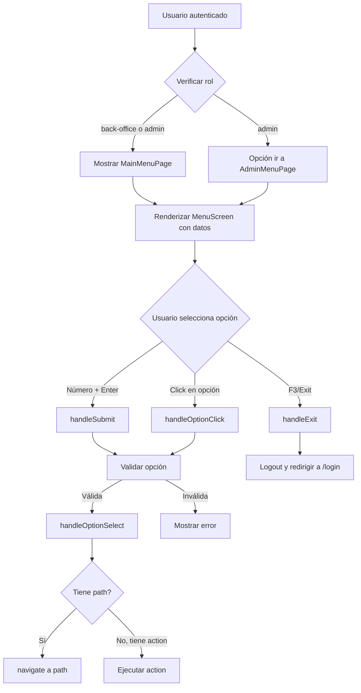
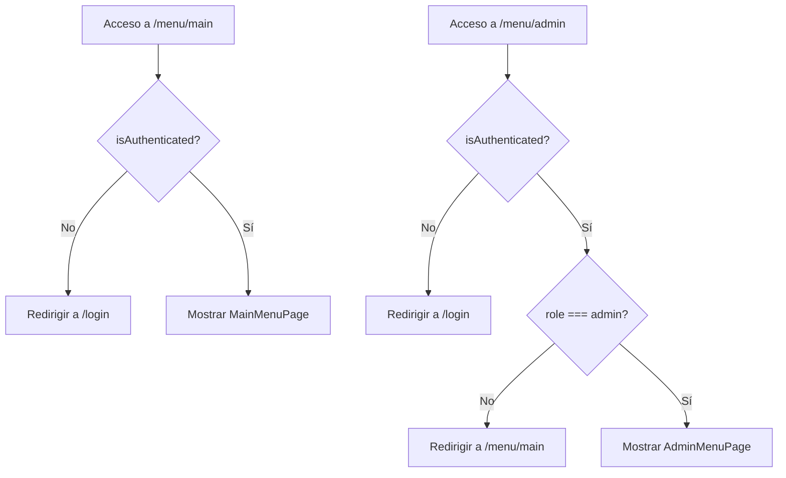

# 🍔 MENU - Módulo de Menús del Sistema

**Módulo ID**: MENU  
**Versión**: 1.0  
**Última actualización**: 2026-03-05  
**Propósito**: Gestión y visualización de menús principales y administrativos del sistema CardDemo con navegación basada en opciones

---

## 📋 Descripción General

El módulo MENU proporciona la interfaz de navegación principal del sistema CardDemo, permitiendo a los usuarios acceder a diferentes funcionalidades del sistema a través de menús organizados según su rol (back-office o admin). Ofrece una experiencia de usuario intuitiva con selección numérica y navegación por clicks.

### Responsabilidades Principales

- ✅ Visualización de menú principal (back-office)
- ✅ Visualización de menú administrativo (solo admin)
- ✅ Navegación basada en roles y permisos
- ✅ Selección de opciones mediante número o click
- ✅ Validación de opciones habilitadas/deshabilitadas
- ✅ Gestión de salida (logout) desde menú
- ✅ Interfaz responsive y accesible
- ✅ Atajos de teclado (F3 para salir)

---

## 🏗️ Arquitectura del Módulo

### Componentes Clave

#### 1. **MenuScreen.tsx** - Componente Principal de Visualización
Ubicación: `/app/components/menu/MenuScreen.tsx`

**Responsabilidad**: Componente de UI reutilizable para renderizar cualquier tipo de menú

**Props**:
```typescript
interface MenuScreenProps {
  menuData: MenuData;              // Datos del menú a mostrar
  onOptionSelect: (option: MenuOption) => void;  // Callback al seleccionar opción
  onExit?: () => void;            // Callback al salir (F3/Exit)
  error?: string | null;          // Error a mostrar
  loading?: boolean;              // Estado de carga
}
```

**Características principales**:
- Campo de entrada numérica (máximo 2 dígitos)
- Lista de opciones numeradas con click directo
- Vista de 2 columnas en pantallas anchas (≥1360px)
- Ajuste dinámico de altura en pantallas pequeñas (<720px)
- Iconos diferenciados (Admin vs Dashboard)
- Badges para opciones solo-admin
- Botón de salida con tecla F3
- Scroll automático cuando hay muchas opciones
- Hover effects y animaciones

#### 2. **useMenu.ts** - Hook Personalizado
Ubicación: `/app/hooks/useMenu.ts`

**Responsabilidad**: Lógica de negocio para navegación y gestión de menú

**Interfaz**:
```typescript
interface UseMenuOptions {
  onError?: (error: string) => void;
  onSuccess?: (option: MenuOption) => void;
}

// Valores retornados
{
  loading: boolean;                    // Estado de carga
  error: string | null;               // Error actual
  handleOptionSelect: (option: MenuOption) => void;  // Manejar selección
  handleExit: () => void;             // Manejar salida
  handleHome: () => void;             // Ir al menú según rol
  handleLogout: () => void;           // Logout directo
  clearError: () => void;             // Limpiar error
}
```

**Funcionalidades**:
- Navegación a ruta de opción seleccionada
- Ejecución de acciones específicas
- Manejo de estados de carga y error
- Redirección al login en logout
- Redirección al menú apropiado según rol del usuario

#### 3. **MainMenuPage.tsx** - Página del Menú Principal
Ubicación: `/app/pages/MainMenuPage.tsx`

**Responsabilidad**: Página del menú principal para usuarios back-office

**Funcionalidades**:
- Verificación de autenticación mediante Redux
- Carga de datos del menú principal
- Permite acceso a usuarios admin y back-office
- Redirección a login si no autenticado
- Integración con hook `useMenu`

#### 4. **AdminMenuPage.tsx** - Página del Menú Administrativo
Ubicación: `/app/pages/AdminMenuPage.tsx`

**Responsabilidad**: Página del menú administrativo solo para admins

**Funcionalidades**:
- Verificación de autenticación y rol admin
- Carga de datos del menú administrativo
- Redirección a menú principal si no es admin
- Redirección a login si no autenticado
- Integración con hook `useMenu`

#### 5. **menuData.ts** - Datos de Menús
Ubicación: `/app/data/menuData.ts`

**Responsabilidad**: Definición y provisión de datos de menús

**Funciones**:
```typescript
export const getMainMenuData = (): MenuData
export const getAdminMenuData = (): MenuData
```

**Opciones del Menú Principal** (10 opciones):
1. Account View - Ver información de cuentas
2. Account Update - Actualizar información de cuentas
3. Credit Card List - Listar todas las tarjetas de crédito
4. Credit Card View - Ver detalles de tarjetas
5. Credit Card Update - Actualizar tarjetas
6. Transaction List - Listar todas las transacciones
7. Transaction View - Ver detalles de transacciones
8. Transaction Add - Agregar nueva transacción
9. Transaction Reports - Generar reportes de transacciones
10. Bill Payment - Procesar pagos de facturas

**Opciones del Menú Admin** (4 opciones):
1. User List (Security) - Listar todos los usuarios del sistema
2. User Add (Security) - Agregar nuevo usuario
3. User Update (Security) - Actualizar información de usuario
4. User Delete (Security) - Eliminar usuario del sistema

#### 6. **menu.ts** - Tipos TypeScript
Ubicación: `/app/types/menu.ts`

**Responsabilidad**: Definición de tipos para el módulo de menús

**Interfaces**:
```typescript
export interface MenuOption {
  id: string;                        // ID único de la opción
  label: string;                     // Etiqueta visible
  description?: string;              // Descripción de la opción
  path?: string;                     // Ruta de navegación
  action?: string;                   // Acción a ejecutar
  disabled?: boolean;                // Si está deshabilitada
  requiredRole?: 'admin' | 'back-office' | 'both';  // Rol requerido
  adminOnly?: boolean;               // Solo para admin
}

export interface MenuData {
  title: string;                     // Título del menú
  subtitle?: string;                 // Subtítulo opcional
  transactionId: string;             // ID de transacción (COBOL legacy)
  programName: string;               // Nombre de programa (COBOL legacy)
  userRole: 'admin' | 'back-office'; // Rol del usuario
  options: MenuOption[];             // Lista de opciones
}
```

---

## 🔗 APIs Documentadas

### Mock API (MSW)
Ubicación: `/app/mocks/menuHandlers.ts`

#### 1. Obtener Menú Principal
```http
GET /api/menu/main
```

**Respuesta exitosa**:
```json
{
  "success": true,
  "data": {
    "title": "CardDemo - Menú Principal",
    "subtitle": "Sistema de Gestión de Tarjetas",
    "transactionId": "CC00",
    "programName": "COMEN01",
    "options": [
      {
        "id": "list-cards",
        "label": "Listar Tarjetas de Crédito",
        "description": "Ver todas las tarjetas registradas",
        "path": "/cards/list"
      },
      // ... más opciones
    ]
  }
}
```

#### 2. Obtener Menú Admin
```http
GET /api/menu/admin
```

**Respuesta exitosa**:
```json
{
  "success": true,
  "data": {
    "title": "CardDemo - Menú de Administración",
    "subtitle": "Funciones Administrativas del Sistema",
    "transactionId": "CADM",
    "programName": "COADM01",
    "options": [
      {
        "id": "manage-users",
        "label": "Gestión de Usuarios",
        "description": "Administrar cuentas de usuario",
        "path": "/admin/users"
      },
      // ... más opciones
    ]
  }
}
```

#### 3. Validar Selección de Opción
```http
POST /api/menu/validate
Content-Type: application/json

{
  "optionId": "list-cards",
  "menuType": "main"
}
```

**Respuesta exitosa**:
```json
{
  "success": true,
  "data": {
    "optionId": "list-cards",
    "validated": true,
    "redirectUrl": "/redirect/list-cards"
  }
}
```

**Respuesta de error**:
```json
{
  "success": false,
  "error": "Opción no válida. Por favor seleccione una opción del 1 al 12."
}
```

---

## 📊 Modelo de Datos

### MenuData
- **title**: Título principal del menú
- **subtitle**: Subtítulo descriptivo (opcional)
- **transactionId**: ID de transacción legacy (ej: "CC00", "CADM")
- **programName**: Nombre de programa legacy (ej: "COMEN01", "COADM01")
- **userRole**: Rol del usuario que accede ('admin' | 'back-office')
- **options**: Array de opciones del menú

### MenuOption
- **id**: Identificador único (ej: "account-view")
- **label**: Texto visible en el menú
- **description**: Descripción de la funcionalidad
- **path**: Ruta de React Router (opcional)
- **action**: Acción personalizada a ejecutar (opcional)
- **disabled**: Si la opción está deshabilitada
- **requiredRole**: Rol requerido para acceder
- **adminOnly**: Marca si es solo para administradores

---

## 🎯 Reglas de Negocio

### Control de Acceso
1. **Menú Principal**: Accesible por usuarios con roles 'admin' y 'back-office'
2. **Menú Admin**: Solo accesible por usuarios con rol 'admin'
3. **Opciones deshabilitadas**: No se pueden seleccionar ni mediante número ni click
4. **Opciones admin-only**: Se marcan visualmente con badge "Admin"

### Navegación
1. **Selección numérica**: El usuario puede ingresar del 1 al número de opciones disponibles
2. **Selección por click**: Click directo en cualquier opción habilitada
3. **Tecla F3 o ESC**: Ejecuta logout y redirige a login
4. **Sin opción válida**: El botón "Continue" está deshabilitado

### Validaciones
1. Input numérico acepta máximo 2 dígitos
2. Solo se permiten números (0-9)
3. La opción seleccionada debe existir en el array de opciones
4. La opción seleccionada no debe estar marcada como `disabled`

### Comportamiento Responsive
1. **Pantallas anchas (≥1360px)**: Vista de 2 columnas
2. **Pantallas pequeñas (<720px)**: Altura máxima ajustada dinámicamente
3. **Móviles**: Vista de 1 columna con scroll vertical

---

## 🔄 Dependencias del Módulo

### Módulos Internos
- **AUTH**: Autenticación y control de acceso basado en roles
- **Layout**: GlobalHeader component
- **Store**: Redux hooks y authSlice

### Bibliotecas Externas
- **React Router**: Navegación entre páginas
- **Material-UI (MUI)**: Componentes de UI
  - Container, Box, Paper, Typography
  - TextField, Button, List, ListItem
  - Alert, Divider, Chip, Stack
  - Iconos: ArrowForwardIos, KeyboardReturn, ExitToApp, AdminPanelSettings, Dashboard
- **Redux**: Gestión de estado global

---

## 🚀 Flujo de Usuario

### Flujo Principal


### Protección de Rutas


---

## 🎨 Características de UI/UX

### Interacciones
- **Hover effect**: Traslación hacia la derecha (8px) con sombra
- **Badges numerados**: Cambian a color primario en hover
- **Disabled state**: Opacidad 0.5 con fondo gris
- **Loading state**: Deshabilita inputs y botones
- **Scroll personalizado**: Barra de scroll estilizada (6px)

### Layout Adaptativo
- **Header y Footer medidos dinámicamente**: Con ResizeObserver
- **Altura de lista calculada**: viewportHeight - headerHeight - footerHeight - 40px
- **Límite máximo en pantallas anchas**: 80vh
- **Grid responsive**: 2 columnas en ≥1360px, 1 columna en móviles

### Accesibilidad
- **aria-label** en navegación: "System back-office options"
- **Enfoque en teclado**: Contenedor principal con tabIndex={-1}
- **Atajos de teclado**: F3 y ESC para salir
- **Estados visuales claros**: Loading, error, disabled

---

## 🧪 Testing

### Escenarios de Prueba

#### Pruebas de Renderizado
- ✅ Renderiza título y subtítulo correctamente
- ✅ Muestra todas las opciones del menú
- ✅ Renderiza badges numerados (1-N)
- ✅ Muestra badge "Admin" en opciones adminOnly
- ✅ Aplica estilos disabled a opciones deshabilitadas

#### Pruebas de Interacción
- ✅ Permite ingresar solo números (máximo 2 dígitos)
- ✅ Deshabilita botón Continue cuando input está vacío
- ✅ Ejecuta handleOptionSelect al hacer submit con número válido
- ✅ Ejecuta handleOptionSelect al hacer click en opción
- ✅ No ejecuta acción en opciones disabled
- ✅ Ejecuta handleExit al presionar F3
- ✅ Ejecuta handleExit al presionar ESC
- ✅ Ejecuta handleExit al hacer click en botón Exit

#### Pruebas de Navegación
- ✅ Navega a path cuando opción tiene path
- ✅ Ejecuta action cuando opción tiene action
- ✅ Muestra estado de loading
- ✅ Muestra errores en Alert

#### Pruebas de Control de Acceso
- ✅ MainMenuPage permite acceso a admin y back-office
- ✅ AdminMenuPage solo permite acceso a admin
- ✅ Redirige a login si no autenticado
- ✅ Redirige a /menu/main si back-office intenta acceder a admin

#### Pruebas de Responsive
- ✅ Muestra 2 columnas en pantallas ≥1360px
- ✅ Muestra 1 columna en pantallas móviles
- ✅ Ajusta altura de lista en pantallas <720px
- ✅ Scroll funciona cuando hay muchas opciones

---

## 📚 Ejemplos de Uso

### Crear un Nuevo Menú
```typescript
// 1. Definir datos del menú
export const getCustomMenuData = (): MenuData => ({
  title: 'Mi Menú Personalizado',
  subtitle: 'Funciones Específicas',
  transactionId: 'CUST',
  programName: 'CUSTOMENU',
  userRole: 'back-office',
  options: [
    {
      id: 'custom-1',
      label: 'Opción Personalizada 1',
      description: 'Descripción de la opción',
      path: '/custom/path1',
    },
    {
      id: 'custom-2',
      label: 'Opción Personalizada 2',
      description: 'Otra descripción',
      path: '/custom/path2',
      adminOnly: true,
    },
  ],
});

// 2. Crear página del menú
export default function CustomMenuPage() {
  const navigate = useNavigate();
  const [menuData, setMenuData] = useState<MenuData | null>(null);
  
  const isAuthenticated = useAppSelector(selectIsAuthenticated);
  const user = useAppSelector(selectCurrentUser);

  useEffect(() => {
    if (!isAuthenticated || !user) {
      navigate('/login', { replace: true });
      return;
    }
    setMenuData(getCustomMenuData());
  }, [navigate, isAuthenticated, user]);

  const { loading, error, handleOptionSelect, handleExit } = useMenu();

  if (!menuData) return null;

  return (
    <MenuScreen
      menuData={menuData}
      onOptionSelect={handleOptionSelect}
      onExit={handleExit}
      error={error}
      loading={loading}
    />
  );
}
```

### Agregar Opción con Acción Personalizada
```typescript
{
  id: 'export-data',
  label: 'Exportar Datos',
  description: 'Exportar información a Excel',
  action: 'export',  // Sin path, solo action
}

// En useMenu
const handleOptionSelect = useCallback(async (option: MenuOption) => {
  if (option.action === 'export') {
    // Ejecutar lógica de exportación
    await exportDataToExcel();
  }
}, []);
```

---

## 🔧 Mejores Prácticas

### Desarrollo
1. **Reutilizar MenuScreen**: No duplicar componente, usar el existente
2. **Centralizar datos**: Mantener datos de menú en `menuData.ts`
3. **Validar roles**: Siempre verificar autenticación y roles en páginas
4. **Usar useMenu hook**: No duplicar lógica de navegación

### Performance
1. **Lazy loading**: Cargar páginas de menú con React.lazy si es necesario
2. **Memoización**: Usar useCallback para handlers
3. **Evitar re-renders**: MenuData en state solo cambia si es necesario

### UX
1. **Feedback visual**: Siempre mostrar loading state durante navegación
2. **Mensajes claros**: Errores descriptivos para el usuario
3. **Accesibilidad**: Mantener aria-labels y soporte de teclado
4. **Responsive**: Probar en diferentes tamaños de pantalla

---

## 📖 Referencias

### Archivos Relacionados
- `/app/components/menu/MenuScreen.tsx`
- `/app/hooks/useMenu.ts`
- `/app/pages/MainMenuPage.tsx`
- `/app/pages/AdminMenuPage.tsx`
- `/app/data/menuData.ts`
- `/app/types/menu.ts`
- `/app/mocks/menuHandlers.ts`

### Dependencias
- Módulo AUTH para control de acceso
- Redux store para estado global
- React Router para navegación
- Material-UI para componentes

---

**Última actualización**: 2026-03-05  
**Versión del documento**: 1.0  
**Mantenedor**: Equipo de Desarrollo CardDemo
