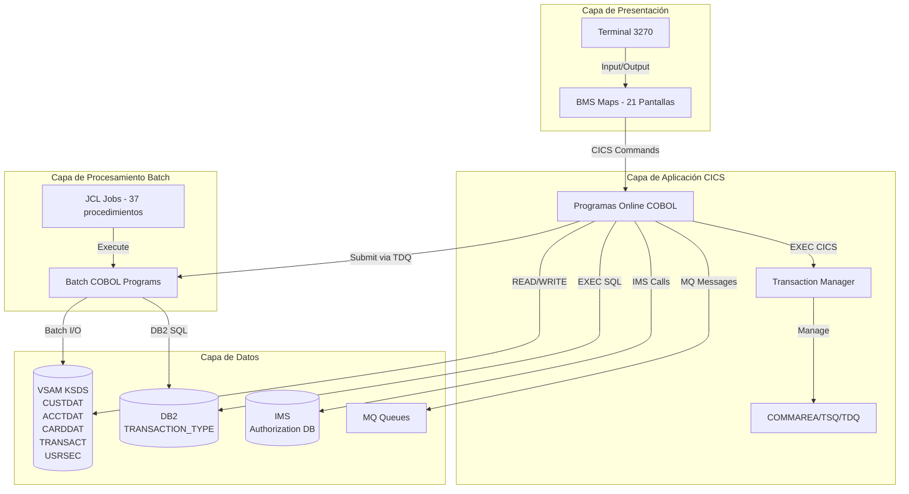
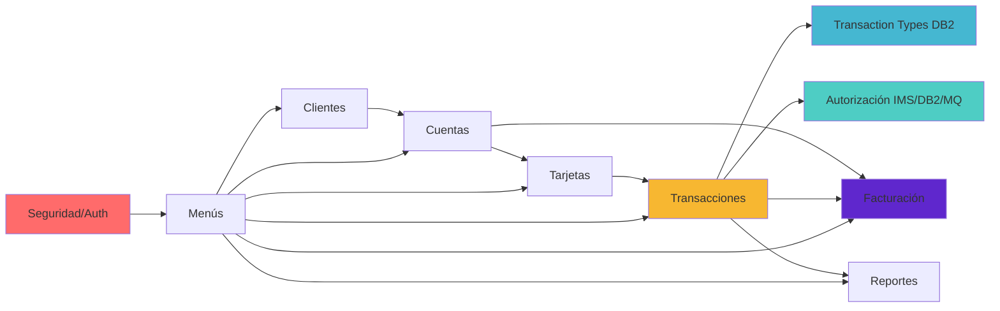

# Sistema CardDemo Legacy - Documentación para User Stories

**Versión**: 2026-03-06  
**Propósito**: Fuente única de verdad para crear User Stories bien estructuradas  
**Aplicación**: CardDemo - Sistema de Gestión de Tarjetas de Crdito Mainframe  
**Tecnología**: COBOL/CICS/DB2/IMS/VSAM

---

## 📊 Estadísticas de la Plataforma

- **Módulos**: 8 dominios funcionales documentados
- **Programas COBOL**: 29 programas (23 core + 6 aplicaciones especializadas)
- **Componentes UI**: 21+ mapas BMS para pantallas 3270
- **Cobertura APIs**: 100% archivos VSAM + DB2 + IMS documentados
- **Idiomas Soportados**: Inglés (sistema mainframe)
- **Archivos de Datos**: 15+ archivos VSAM/DB2
- **Jobs Batch**: 37 procedimientos JCL documentados
- **Copybooks**: 28 estructuras de datos reutilizables

---

## 🏗️ Arquitectura de Alto Nivel

### Stack Tecnológico

#### Backend
- **COBOL**: Enterprise COBOL for z/OS (v4.2+)
- **CICS**: Customer Information Control System v5.x
- **DB2**: DB2 for z/OS v11+
- **IMS**: Information Management System v14+
- **MQ**: IBM MQ for z/OS v9+
- **VSAM**: Virtual Storage Access Method (KSDS, ESDS, RRDS)

#### Frontend
- **BMS**: Basic Mapping Support (Pantallas 3270)
- **Terminal**: IBM 3270 terminal emulation
- **Mapas**: 21 pantallas definidas con BMS

#### Base de Datos
- **VSAM KSDS**: Archivos indexados principales (Customer, Account, Card, Transaction)
- **DB2**: Tablas relacionales (Transaction Types, Authorization Rules)
- **IMS**: Base de datos jerárquica (Authorization Processing)
- **AIX**: Índices alternativos para referencias cruzadas

#### Caché/Messaging
- **TDQ**: Transient Data Queue (para reportes y batch jobs)
- **TSQ**: Temporary Storage Queue (para paginación)
- **MQ**: Message Queue para procesamiento asíncrono
- **COMMAREA**: Comunicación inter-transaccional

### Patrones Arquitectónicos

- **Patrón Repository**: Acceso a datos encapsulado (VSAM READ/WRITE)
- **Service Layer**: Lógica de negocio encapsulada en programas COBOL
- **Multi-tenancy**: NO implementado (sistema monolítico)
- **Autenticación**: Basada en archivo USRSEC (User ID + Password)
- **Autorización**: IMS DB2 MQ para transacciones críticas
- **Gestión de Transacciones**: CICS Transaction Manager
- **Procesamiento Batch**: JCL con COBOL batch programs

---

## 📚 Catálogo de Módulos

### [MÓDULO-1] SEGURIDAD Y AUTENTICACIÓN

**ID**: `security-auth`  
**Propósito**: Gestionar el inicio de sesión y control de acceso de usuarios al sistema CardDemo

#### Componentes Clave
- **COSGN00C**: Programa de sign-on/autenticación
- **COUSR00C**: Listado de usuarios
- **COUSR01C**: Consulta/actualización de usuario
- **COUSR02C**: Eliminación de usuario
- **COUSR03C**: Mantenimiento de seguridad de usuario

#### APIs Públicas
```cobol
EXEC CICS READ FILE('USRSEC')
    INTO(SEC-USER-RECORD)
    RIDFLD(WS-USER-ID)
    RESP(WS-RESP-CD)
END-EXEC

EXEC CICS WRITE FILE('USRSEC')
    FROM(SEC-USER-RECORD)
    RIDFLD(SEC-USER-ID)
    RESP(WS-RESP-CD)
END-EXEC
```

#### Archivos Utilizados
- **USRSEC**: VSAM KSDS (Key: User ID 8 caracteres, RecLen: 80)

#### Pantallas BMS
- **COSGN00**: Pantalla de inicio de sesión
- **COUSR00**: Lista de usuarios (paginación)
- **COUSR01**: Detalle/actualización de usuario
- **COUSR02**: Confirmación eliminación
- **COUSR03**: Mantenimiento seguridad

#### Ejemplos de User Story
```
US-SEC-001: Como administrador del sistema, quiero listar todos los usuarios activos 
para revisar los accesos al sistema CardDemo.

US-SEC-002: Como administrador, quiero crear nuevos usuarios con diferentes tipos 
(Admin, User, Guest) para controlar permisos de acceso.

US-SEC-003: Como usuario del sistema, quiero iniciar sesión con mi User ID y Password 
para acceder a las funciones del sistema CardDemo.
```

#### Reglas de Negocio
- User ID debe ser único (8 caracteres alfanuméricos)
- Password debe ser mínimo 8 caracteres
- Tipos de usuario: ADMIN, USER, GUEST
- Máximo 3 intentos de login fallidos bloquean al usuario
- Timeout de sesión: 15 minutos de inactividad

---

### [MÓDULO-2] GESTIÓN DE CLIENTES

**ID**: `customer-mgmt`  
**Propósito**: Administrar la información maestra de clientes (tarjetahabientes)

#### Componentes Clave
- **CBCUS01C**: Consulta de cliente (CICS online)
- **CBEXPORT**: Exportación de datos de clientes para migración de sucursales
- **CBIMPORT**: Importación de datos de clientes desde archivo de exportación

#### APIs Públicas
```cobol
* Lectura de cliente
EXEC CICS READ FILE('CUSTDAT')
    INTO(CUSTOMER-RECORD)
    RIDFLD(WS-CUST-ID)
    RESP(WS-RESP-CD)
END-EXEC

* Actualización de cliente
EXEC CICS REWRITE FILE('CUSTDAT')
    FROM(CUSTOMER-RECORD)
    RESP(WS-RESP-CD)
END-EXEC
```

#### Archivos Utilizados
- **CUSTDAT**: VSAM KSDS (Key: Customer ID 9 dígitos, RecLen: 500)

#### Modelo de Datos (CUSTREC.cpy)
```cobol
01  CUSTOMER-RECORD.
    05  CUST-ID                      PIC 9(09).
    05  CUST-FIRST-NAME              PIC X(25).
    05  CUST-MIDDLE-NAME             PIC X(25).
    05  CUST-LAST-NAME               PIC X(25).
    05  CUST-ADDR-LINE-1             PIC X(50).
    05  CUST-ADDR-LINE-2             PIC X(50).
    05  CUST-ADDR-LINE-3             PIC X(50).
    05  CUST-ADDR-STATE-CD           PIC X(02).
    05  CUST-ADDR-COUNTRY-CD         PIC X(03).
    05  CUST-ADDR-ZIP                PIC X(10).
    05  CUST-PHONE-NUM-1             PIC X(15).
    05  CUST-PHONE-NUM-2             PIC X(15).
    05  CUST-SSN                     PIC 9(09).
    05  CUST-GOVT-ISSUED-ID          PIC X(20).
    05  CUST-DOB-YYYYMMDD            PIC X(10).
    05  CUST-EFT-ACCOUNT-ID          PIC X(10).
    05  CUST-PRI-CARD-HOLDER-IND     PIC X(01).
    05  CUST-FICO-CREDIT-SCORE       PIC 9(03).
```

#### Jobs Batch Relacionados
- **DEFCUST**: Definir archivo VSAM KSDS de clientes
- **READCUST**: Lectura/listado de archivo de clientes
- **CBEXPORT**: Exportación multi-registro para migración
- **CBIMPORT**: Importación con validación de checksums

#### Ejemplos de User Story
```
US-CUS-001: Como representante de servicio al cliente, quiero buscar clientes por ID 
para consultar su información personal y de contacto.

US-CUS-002: Como sistema batch, quiero exportar datos de clientes a un formato multi-registro 
para migración entre sucursales.

US-CUS-003: Como operador batch, quiero importar datos de clientes validando checksums 
para asegurar integridad de datos migrados.
```

#### Reglas de Negocio
- Customer ID es numérico de 9 dígitos (único)
- SSN debe ser válido (9 dígitos)
- FICO Score rango: 300-850
- Fecha de nacimiento formato: YYYY-MM-DD
- Primary Card Holder Indicator: Y/N
- Dirección completa requerida (State Code 2 chars, Country Code 3 chars)

---

### [MÓDULO-3] GESTIÓN DE CUENTAS

**ID**: `account-mgmt`  
**Propósito**: Administrar cuentas de tarjetas de crédito, balances y límites de crédito

#### Componentes Clave
- **COACTVWC**: Visualización detallada de cuenta (CICS)
- **COACTUPC**: Actualización de cuenta (CICS)
- **CBACT01C**: Lectura de archivo de cuentas a archivos de salida (Batch)
- **CBACT02C**: Actualización de cuentas (Batch/CICS)
- **CBACT03C**: Consulta de balance de cuenta (Batch/CICS)
- **CBACT04C**: Visualización de cuenta (CICS)

#### APIs Públicas
```cobol
* Lectura de cuenta
EXEC CICS READ FILE('ACCTDAT')
    INTO(ACCOUNT-RECORD)
    RIDFLD(WS-ACCT-ID)
    RESP(WS-RESP-CD)
END-EXEC

* Actualización de cuenta con índice alternativo (AIX)
EXEC CICS READ FILE('CXACAIX')
    INTO(CARD-XREF-RECORD)
    RIDFLD(WS-CARD-NUM)
    RESP(WS-RESP-CD)
END-EXEC
```

#### Archivos Utilizados
- **ACCTDAT**: VSAM KSDS (Key: Account ID 11 dígitos, RecLen: 300)
- **CXACAIX**: VSAM AIX (Índice alternativo Card→Account)

#### Modelo de Datos (CVACT01Y.cpy)
```cobol
01  ACCOUNT-RECORD.
    05  ACCT-ID                      PIC 9(11).
    05  ACCT-ACTIVE-STATUS           PIC X(01).
    05  ACCT-CURR-BAL                PIC S9(10)V99.
    05  ACCT-CREDIT-LIMIT            PIC S9(10)V99.
    05  ACCT-CASH-CREDIT-LIMIT       PIC S9(10)V99.
    05  ACCT-OPEN-DATE               PIC X(10).
    05  ACCT-EXPIRAION-DATE          PIC X(10).
    05  ACCT-REISSUE-DATE            PIC X(10).
    05  ACCT-CURR-CYC-CREDIT         PIC S9(10)V99.
    05  ACCT-CURR-CYC-DEBIT          PIC S9(10)V99.
    05  ACCT-ADDR-ZIP                PIC X(10).
    05  ACCT-GROUP-ID                PIC X(10).
```

#### Pantallas BMS
- **COACTVW**: Vista detallada de cuenta
- **COACTUP**: Actualización de cuenta

#### Jobs Batch Relacionados
- **ACCTFILE**: Definir archivo de cuentas
- **READACCT**: Lectura/listado de cuentas
- **CBACT01C**: Procesamiento batch de cuentas

#### Ejemplos de User Story
```
US-ACC-001: Como representante de servicio, quiero visualizar el detalle completo de una cuenta 
para revisar balance actual, límite de crédito y fechas importantes.

US-ACC-002: Como supervisor, quiero actualizar el límite de crédito de una cuenta 
para aprobar aumentos solicitados por clientes.

US-ACC-003: Como proceso batch nocturno, quiero actualizar los balances de ciclo actual 
para reflejar cargos y créditos del día.
```

#### Reglas de Negocio
- Account ID numérico 11 dígitos (único)
- Active Status: A (Active), C (Closed), S (Suspended)
- Current Balance puede ser negativo (crédito)
- Credit Limit máximo: $99,999,999.99
- Cash Credit Limit <= 50% del Credit Limit
- Cycle Credits/Debits se resetean mensualmente
- Group ID para cuentas corporativas (10 caracteres)

---

### [MÓDULO-4] GESTIÓN DE TARJETAS

**ID**: `card-mgmt`  
**Propósito**: Administrar tarjetas físicas asociadas a cuentas

#### Componentes Clave
- **COCRDLIC**: Listado de tarjetas (CICS)
- **COCRDSLC**: Búsqueda/selección de tarjetas (CICS)
- **COCRDUPC**: Actualización de tarjeta (CICS)

#### APIs Públicas
```cobol
* Lectura de tarjeta
EXEC CICS READ FILE('CARDDAT')
    INTO(CARD-RECORD)
    RIDFLD(WS-CARD-NUM)
    RESP(WS-RESP-CD)
END-EXEC

* Obtener Account ID desde Card Number (AIX)
EXEC CICS READ FILE('CXACAIX')
    INTO(XREF-RECORD)
    RIDFLD(WS-CARD-NUM)
    RESP(WS-RESP-CD)
END-EXEC
```

#### Archivos Utilizados
- **CARDDAT**: VSAM KSDS (Key: Card Number, RecLen: Variable)
- **CXACAIX**: VSAM AIX (Card→Account cross-reference)
- **CCXREF**: Archivo de referencia cruzada alternativo

#### Pantallas BMS
- **COCRDLI**: Lista de tarjetas
- **COCRDSL**: Búsqueda de tarjetas
- **COCRDUP**: Actualización de tarjeta

#### Jobs Batch Relacionados
- **CARDFILE**: Definir archivo de tarjetas
- **READCARD**: Lectura/listado de tarjetas
- **XREFFILE**: Definir cross-reference
- **READXREF**: Mantenimiento de referencias cruzadas

#### Ejemplos de User Story
```
US-CRD-001: Como representante de servicio, quiero listar todas las tarjetas de un cliente 
para verificar tarjetas activas e inactivas.

US-CRD-002: Como sistema, quiero buscar una cuenta por número de tarjeta 
usando el índice alternativo para procesamiento rápido de transacciones.

US-CRD-003: Como supervisor, quiero actualizar el estado de una tarjeta (activar/desactivar/reemplazar) 
para gestionar reemisiones y reportes de robo/pérdida.
```

#### Reglas de Negocio
- Card Number único por cuenta
- Una cuenta puede tener múltiples tarjetas
- Estados: Active, Inactive, Lost, Stolen, Expired
- CXACAIX permite lookup bidireccional Card↔Account
- Tarjetas vencidas no permiten transacciones
- Reemplazo de tarjeta genera nuevo Card Number

---

### [MÓDULO-5] PROCESAMIENTO DE TRANSACCIONES

**ID**: `transaction-processing`  
**Propósito**: Procesar, almacenar y consultar transacciones de tarjetas de crédito

#### Componentes Clave Online (CICS)
- **COTRN00C**: Listado de transacciones
- **COTRN01C**: Detalle de transacción
- **COTRN02C**: Búsqueda de transacciones

#### Componentes Clave Batch
- **CBTRN01C**: Procesamiento de transacciones
- **CBTRN02C**: Reconciliación de transacciones
- **CBTRN03C**: Posteo de transacciones

#### APIs Públicas
```cobol
* Lectura de transacción
EXEC CICS READ FILE('TRANSACT')
    INTO(TRANSACTION-RECORD)
    RIDFLD(WS-TRAN-ID)
    RESP(WS-RESP-CD)
END-EXEC

* Escritura de nueva transacción
EXEC CICS WRITE FILE('TRANSACT')
    FROM(TRANSACTION-RECORD)
    RIDFLD(TRAN-ID)
    RESP(WS-RESP-CD)
END-EXEC
```

#### Archivos Utilizados
- **TRANSACT**: VSAM KSDS (Key: Transaction ID, RecLen: Variable)
- **TRANCAT**: Categorías de transacciones
- **TRANCATBAL**: Balances por categoría de transacción

#### Modelo de Datos (CVTRAxx.cpy)
- **CVTRA01Y**: Transaction Category Balance (RecLen: 50)
  - Account ID + Transaction Type + Transaction Category Code + Balance
- **CVTRA02Y**: Transaction Detail
- **CVTRA03Y**: Transaction Summary
- **CVTRA04Y**: Transaction Category Definitions
- **CVTRA05Y**: Transaction Posting Rules
- **CVTRA06Y**: Transaction Cross-reference
- **CVTRA07Y**: Transaction Reconciliation

#### Pantallas BMS
- **COTRN00**: Lista de transacciones (paginada)
- **COTRN01**: Detalle de transacción
- **COTRN02**: Búsqueda de transacciones

#### Jobs Batch Relacionados
- **TRANFILE**: Definir archivo de transacciones
- **TRANTYPE**: Crear archivo de tipos de transacción
- **TRANCATG**: Definir categorías de transacción
- **TRANIDX**: Crear índice alternativo (AIX) en transacciones
- **TRANREPT**: Generar reporte de transacciones
- **POSTTRAN**: Postear transacciones al master
- **TRANBKP**: Backup y eliminación de transacciones (REPRO)
- **COMBTRAN**: Combinar transacciones de múltiples fuentes
- **TCATBALF**: Mantenimiento de balances por categoría
- **INTCALC**: Cálculo de intereses

#### Ejemplos de User Story
```
US-TRN-001: Como cliente, quiero consultar mis últimas transacciones en línea 
para revisar cargos recientes en mi cuenta.

US-TRN-002: Como proceso batch nocturno, quiero postear transacciones autorizadas 
para actualizar balances de cuentas.

US-TRN-003: Como analista de fraude, quiero buscar transacciones por monto y categoría 
para detectar patrones sospechosos.
```

#### Reglas de Negocio
- Transaction ID único generado secuencialmente
- Tipos de transacción: Purchase, Cash Advance, Payment, Adjustment, Reversal
- Categorías: Retail, Dining, Travel, Gas, Grocery, etc.
- Balances por categoría se actualizan en tiempo real
- Transacciones históricas > 90 días se archivan
- Reportes se generan vía TDQ (Transient Data Queue)

---

### [MÓDULO-6] TIPOS DE TRANSACCIÓN (DB2)

**ID**: `transaction-types-db2`  
**Propósito**: Gestionar catálogo de tipos de transacciones en DB2 con paginación por cursor

#### Componentes Clave
- **COTRTLIC**: Listado de tipos de transacción (CICS + DB2 cursor paging)
- **COTRTUPC**: Actualización de tipo de transacción (CICS + DB2)
- **COBTUPDT**: Actualización batch de tipos de transacción

#### APIs Públicas DB2
```cobol
* Declarar cursor para paginación
EXEC SQL
    DECLARE TTYPE-CURSOR CURSOR FOR
    SELECT TRAN_TYPE_CD, TRAN_TYPE_DESC
    FROM TRANSACTION_TYPE
    ORDER BY TRAN_TYPE_CD
END-EXEC

* Abrir cursor
EXEC SQL OPEN TTYPE-CURSOR END-EXEC

* Fetch siguiente página (7 filas por pantalla)
EXEC SQL
    FETCH NEXT FROM TTYPE-CURSOR
    INTO :WS-TRAN-TYPE-CD, :WS-TRAN-TYPE-DESC
END-EXEC

* Actualizar tipo de transacción
EXEC SQL
    UPDATE TRANSACTION_TYPE
    SET TRAN_TYPE_DESC = :WS-TRAN-TYPE-DESC
    WHERE TRAN_TYPE_CD = :WS-TRAN-TYPE-CD
END-EXEC
```

#### Tablas DB2 Utilizadas
- **TRANSACTION_TYPE**: Catálogo de tipos de transacción

#### Pantallas BMS
- **COTRTLI**: Lista de tipos (paginación con cursor DB2)
- **COTRTUP**: Crear/actualizar tipo de transacción

#### Jobs Batch Relacionados
- **TRANEXTR**: Extracción de tipos de transacción desde DB2
- **MNTTRDB2**: Mantenimiento de tablas DB2 de tipos de transacción
- **CREADB21**: Creación de estructuras DB2 v2.1

#### Ejemplos de User Story
```
US-TTY-001: Como administrador de sistema, quiero listar tipos de transacción con paginación 
para revisar el catálogo completo sin saturar la pantalla.

US-TTY-002: Como configurador, quiero crear nuevos tipos de transacción en DB2 
para soportar nuevas categorías de negocio.

US-TTY-003: Como proceso batch, quiero extraer tipos de transacción desde DB2 
para generar archivos de configuración VSAM.
```

#### Reglas de Negocio
- Transaction Type Code único (clave primaria DB2)
- Máximo 7 registros por pantalla (cursor paging)
- Descripción máximo 50 caracteres
- Operaciones CRUD completas (Create, Read, Update, Delete)
- Flag de eliminación lógica (no física)
- Integración bidireccional DB2 ↔ VSAM

---

### [MÓDULO-7] AUTORIZACIÓN (IMS/DB2/MQ)

**ID**: `authorization-ims-db2-mq`  
**Propósito**: Procesar autorizaciones de transacciones críticas con IMS, DB2 y MQ

#### Componentes Clave Online (CICS)
- **COPAUS0C**: Resumen de autorización (IMS/DB2 integration)
- **COPAUS1C**: Detalle de autorización (Transaction lookup)
- **COPAUS2C**: Procesamiento de autorización (DB2/MQ messaging)

#### Componentes Clave Batch
- **CBPAUP0C**: Autorización batch de pagos

#### APIs Públicas
```cobol
* Llamada IMS para consulta de autorización
EXEC CICS START TRANSACTION('IMSA')
    FROM(IMS-AUTH-REQUEST)
    LENGTH(IMS-REQUEST-LEN)
END-EXEC

* Escritura a cola MQ para procesamiento asíncrono
EXEC CICS WRITEQ TS
    QUEUE('AUTHQ')
    FROM(AUTH-MESSAGE)
    LENGTH(AUTH-MSG-LEN)
END-EXEC
```

#### Recursos IMS/DB2/MQ
- **IMS Database**: Hierarchical authorization data
- **DB2 Tables**: Authorization rules and limits
- **MQ Queues**: Async authorization messages

#### Pantallas BMS
- **COPAU00**: Resumen de autorizaciones
- **COPAU01**: Detalle de autorización

#### Copybooks Específicos
- **CCPAURLY**: Authorization rules
- **CIPAUDTY**: IMS authorization data types
- **CCPAUERY**: Authorization error codes
- **CIPAUSMY**: Authorization summary structures
- **CCPAURQY**: Authorization request structures
- **IMSFUNCS**: IMS function codes

#### Jobs Batch Relacionados
- **CBPAUP0J**: Batch password authorization processing
- **DBPAUTP0**: DB2 authorization table population

#### Ejemplos de User Story
```
US-AUT-001: Como sistema de punto de venta, quiero autorizar transacciones en tiempo real 
consultando reglas en IMS y DB2 para aprobar o rechazar compras.

US-AUT-002: Como proceso batch nocturno, quiero procesar autorizaciones de pagos diferidos 
enviando mensajes a MQ para procesamiento asíncrono.

US-AUT-003: Como analista de seguridad, quiero consultar el historial de autorizaciones 
para auditar decisiones de aprobación/rechazo.
```

#### Reglas de Negocio
- Autorización en < 3 segundos (requisito tiempo real)
- Validación contra límite de crédito disponible
- Verificación de estado de tarjeta (activa/bloqueada)
- Detección de transacciones duplicadas (5 minutos)
- Registro de todas las autorizaciones en IMS
- Sincronización DB2/IMS cada 5 minutos
- MQ para procesamiento asíncrono de reversals

---

### [MÓDULO-8] FACTURACIÓN Y REPORTES

**ID**: `billing-reports`  
**Propósito**: Procesar pagos de facturas y generar reportes del sistema

#### Componentes Clave
- **COBIL00C**: Procesamiento de pago de factura (CICS)
- **CORPT00C**: Solicitud de reporte de transacciones (CICS submit batch via TDQ)

#### APIs Públicas
```cobol
* Posteo de pago a cuenta
EXEC CICS READ FILE('ACCTDAT')
    INTO(ACCOUNT-RECORD)
    UPDATE
    RIDFLD(WS-ACCT-ID)
    RESP(WS-RESP-CD)
END-EXEC

* Actualizar balance
COMPUTE ACCT-CURR-BAL = ACCT-CURR-BAL - WS-PAYMENT-AMT

EXEC CICS REWRITE FILE('ACCTDAT')
    FROM(ACCOUNT-RECORD)
    RESP(WS-RESP-CD)
END-EXEC

* Submit job batch vía TDQ
EXEC CICS WRITEQ TD
    QUEUE('RPTQ')
    FROM(JCL-CARD)
    LENGTH(80)
END-EXEC
```

#### Archivos Utilizados
- **ACCTDAT**: Account master (para actualización de balance)
- **TRANSACT**: Registro de transacción de pago
- **CXACAIX**: Card→Account xref
- **TDQ (RPTQ)**: Transient Data Queue para submit de reportes

#### Pantallas BMS
- **COBIL00**: Pago de factura
- **CORPT00**: Solicitud de reporte

#### Jobs Batch Relacionados
- **REPTFILE**: Definir GDG para salida de reportes
- **TRANREPT**: Generar reporte de transacciones
- **PRTCATBL**: Imprimir balance por categoría de transacción

#### Ejemplos de User Story
```
US-BIL-001: Como cliente, quiero pagar mi factura en línea 
para reducir mi balance pendiente inmediatamente.

US-BIL-002: Como representante de servicio, quiero solicitar un reporte de transacciones 
para enviarlo al cliente vía email.

US-BIL-003: Como auditor, quiero generar reporte de balances por categoría 
para análisis de consumo mensual.
```

#### Reglas de Negocio
- Pago mínimo: $10.00
- Pago máximo: Current Balance
- Transacción de pago se registra con tipo "PAYMENT"
- Balance se actualiza inmediatamente
- Reportes se generan en batch (no online)
- TDQ submits JCL automáticamente
- Reportes se almacenan en GDG (Generational Data Groups)

---

## 🎨 NAVEGACIÓN Y MENÚS

### [MÓDULO-9] MENÚS Y ADMINISTRACIÓN

**ID**: `menus-admin`  
**Propósito**: Navegación central y funciones administrativas

#### Componentes Clave
- **COMEN01C**: Menú principal de la aplicación
- **COADM01C**: Menú de administración

#### Pantallas BMS
- **COMEN01**: Menú principal
- **COADM01**: Menú administrativo

#### Ejemplos de User Story
```
US-MEN-001: Como usuario autenticado, quiero ver el menú principal 
para navegar a las diferentes funciones del sistema CardDemo.

US-MEN-002: Como administrador, quiero acceder al menú administrativo 
para gestionar usuarios y configuraciones del sistema.
```

---

## 🔄 Diagrama de Arquitectura



---

## 📊 Diagrama de Dependencias de Módulos



---

## 📋 Reglas de Negocio por Módulo

### Seguridad y Autenticación
1. **Longitud de User ID**: Exactamente 8 caracteres alfanuméricos
2. **Longitud de Password**: Mínimo 8 caracteres
3. **Tipos de Usuario**: ADMIN, USER, GUEST (control de permisos)
4. **Bloqueo por Intentos Fallidos**: Máximo 3 intentos consecutivos
5. **Timeout de Sesión**: 15 minutos de inactividad
6. **Archivo de Seguridad**: USRSEC VSAM KSDS (RecLen: 80)

### Clientes
1. **Customer ID**: Numérico 9 dígitos (único, no reutilizable)
2. **SSN**: Social Security Number 9 dígitos (validación de formato)
3. **FICO Score**: Rango 300-850 (para aprobación de crédito)
4. **Fecha de Nacimiento**: Formato YYYY-MM-DD (validación de edad >= 18)
5. **Primary Card Holder**: Indicador Y/N (solo uno por cuenta)
6. **Dirección Completa**: State Code 2 chars, Country Code 3 chars, ZIP 10 chars
7. **Teléfonos**: Dos números opcionales (15 chars cada uno)

### Cuentas
1. **Account ID**: Numérico 11 dígitos (único, generado secuencialmente)
2. **Estados Válidos**: A (Active), C (Closed), S (Suspended)
3. **Balance Actual**: Puede ser negativo (indica crédito a favor)
4. **Límite de Crédito**: Máximo $99,999,999.99
5. **Límite Cash Advance**: Máximo 50% del límite de crédito total
6. **Balances de Ciclo**: Se resetean al inicio de cada ciclo de facturación
7. **Fechas Importantes**: Open Date, Expiration Date, Reissue Date (formato YYYY-MM-DD)
8. **Group ID**: Para cuentas corporativas (10 caracteres)

### Tarjetas
1. **Card Number**: Único por cuenta (puede haber múltiples tarjetas por cuenta)
2. **Estados de Tarjeta**: Active, Inactive, Lost, Stolen, Expired
3. **Índice Alternativo**: CXACAIX permite lookup bidireccional Card↔Account
4. **Tarjetas Vencidas**: No permiten transacciones (validación en autorización)
5. **Reemplazo de Tarjeta**: Genera nuevo Card Number (mantiene Account ID)
6. **Cross-Reference**: CCXREF archivo alternativo para referencias

### Transacciones
1. **Transaction ID**: Único generado secuencialmente (no reutilizable)
2. **Tipos de Transacción**: Purchase, Cash Advance, Payment, Adjustment, Reversal
3. **Categorías**: Retail, Dining, Travel, Gas, Grocery, Entertainment, Healthcare, etc.
4. **Balance por Categoría**: Actualización en tiempo real en TRANCATBAL
5. **Archivado**: Transacciones > 90 días se mueven a archivo histórico
6. **Reportes**: Generados vía TDQ (Transient Data Queue) a batch
7. **Reconciliación**: Proceso batch diario (CBTRN02C)
8. **Posteo**: Actualización de balances de cuenta (CBTRN03C)

### Tipos de Transacción (DB2)
1. **Transaction Type Code**: Clave primaria única en DB2
2. **Paginación**: Máximo 7 registros por pantalla (cursor DB2)
3. **Descripción**: Máximo 50 caracteres
4. **Operaciones CRUD**: Create, Read, Update, Delete completo
5. **Eliminación Lógica**: Flag de eliminación (no física)
6. **Sincronización**: Bidireccional DB2 ↔ VSAM

### Autorización (IMS/DB2/MQ)
1. **Tiempo de Respuesta**: < 3 segundos (requisito tiempo real)
2. **Validación de Límite**: Compara contra límite de crédito disponible
3. **Estado de Tarjeta**: Solo tarjetas activas pueden autorizar
4. **Detección de Duplicados**: Transacciones duplicadas dentro de 5 minutos se rechazan
5. **Registro IMS**: Todas las autorizaciones se registran en IMS
6. **Sincronización**: DB2/IMS cada 5 minutos
7. **Procesamiento Asíncrono**: Reversals via MQ

### Facturación y Reportes
1. **Pago Mínimo**: $10.00 (configurable)
2. **Pago Máximo**: No puede exceder Current Balance
3. **Tipo de Transacción Pago**: Automáticamente tipo "PAYMENT"
4. **Actualización de Balance**: Inmediata (online)
5. **Generación de Reportes**: Solo en batch (no online)
6. **TDQ Submit**: JCL se submite automáticamente
7. **Almacenamiento de Reportes**: GDG (Generational Data Groups) con retención de 7 generaciones

---

## 📋 Patrones de Form y List

### ⚠️ IMPORTANTE: Análisis de Patrones Reales

**NOTA**: Este sistema legacy utiliza BMS (Basic Mapping Support) para pantallas 3270, NO componentes web modernos. Los siguientes patrones son específicos de la tecnología mainframe.

### Estructura de Componentes BMS

```
Legacy-code/
 bms/                    # Definiciones de mapas BMS
   ├── COSGN00.bms        # Mapa de sign-on
   ├── COUSR00.bms        # Mapa de lista de usuarios
   ├── COACTVW.bms        # Mapa de vista de cuenta
   └── ...                # 21 mapas BMS totales
 cpy-bms/               # Copybooks generados desde BMS
   ├── COPAU00.cpy        # Copybook de mapa COPAU00
   └── ...                # Generados automáticamente
 cbl/                   # Programas COBOL que usan los mapas
    ├── COSGN00C.cbl       # Usa COSGN00 BMS map
    ├── COUSR00C.cbl       # Usa COUSR00 BMS map
    └── ...
```

### Patrones de Pantalla Identificados

#### Pattern A - Pantalla de Lista con Paginación (COUSR00, COTRN00)

**Características**:
- Display de 10 líneas por pantalla
- Navegación PF7/PF8 (Previous/Next page)
- Uso de TSQ (Temporary Storage Queue) para mantener estado
- Selección con campo de 1 carácter por línea

**Ejemplo COBOL**:
```cobol
* Envío de pantalla de lista
EXEC CICS SEND MAP('COUSR00A')
    MAPSET('COUSR00')
    FROM(COUSR0AO)
    ERASE
    CURSOR
END-EXEC

* Control de paginación
EVALUATE EIBAID
    WHEN DFHPF7
        PERFORM PREVIOUS-PAGE
    WHEN DFHPF8
        PERFORM NEXT-PAGE
    WHEN DFHENTER
        PERFORM PROCESS-SELECTION
END-EVALUATE
```

#### Pattern B - Pantalla de Detalle/Actualización (COACTUPC, COCRDUPC)

**Características**:
- Campos protegidos y no protegidos (BRT, DRK, NORM)
- Validación campo por campo
- Uso de COMMAREA para pasar datos
- Mensajes de error en línea de mensaje dedicada

**Ejemplo COBOL**:
```cobol
* Recepción de datos de pantalla
EXEC CICS RECEIVE MAP('COACTUPA')
    MAPSET('COACTUP')
    INTO(COACTAI)
    RESP(WS-RESP-CD)
END-EXEC

* Validación
IF ACCT-ID-L OF COACTAI > 0
    MOVE ACCT-ID-I OF COACTAI TO WS-ACCT-ID
    PERFORM VALIDATE-ACCOUNT-ID
END-IF
```

#### Pattern C - Pantalla de Búsqueda (COCRDSLC, COTRN02C)

**Características**:
- Múltiples criterios de búsqueda
- Resultados en la misma pantalla
- Browse secuencial con START/READNEXT

**Ejemplo COBOL**:
```cobol
* Browse con START
EXEC CICS START BROWSE
    FILE('CARDDAT')
    RIDFLD(WS-SEARCH-KEY)
    GTEQ
    RESP(WS-RESP-CD)
END-EXEC

* Lectura secuencial
PERFORM UNTIL USER-SEC-EOF
    EXEC CICS READNEXT FILE('CARDDAT')
        INTO(CARD-RECORD)
        RIDFLD(WS-CARD-NUM)
        RESP(WS-RESP-CD)
    END-EXEC
END-PERFORM
```

### Patrones de Validación

#### Validación de Entrada (sin librería externa)

**Método**: Código COBOL nativo

```cobol
* Validación numérica
IF ACCT-ID-L OF SCREEN-INPUT > 0
    IF ACCT-ID-I OF SCREEN-INPUT IS NOT NUMERIC
        MOVE 'Account ID must be numeric' TO WS-ERROR-MSG
        MOVE -1 TO ACCT-ID-L OF SCREEN-OUTPUT
        SET ERROR-FLAG TO TRUE
    END-IF
END-IF

* Validación de rango
IF WS-CREDIT-LIMIT < 0 OR WS-CREDIT-LIMIT > 99999999.99
    MOVE 'Credit limit out of range' TO WS-ERROR-MSG
    SET ERROR-FLAG TO TRUE
END-IF

* Validación de fecha
CALL 'CSUTLDTC' USING WS-DATE-FIELD WS-VALID-FLAG
IF WS-VALID-FLAG = 'N'
    MOVE 'Invalid date format' TO WS-ERROR-MSG
END-IF
```

### Patrones de Notificación

#### Notificación via Línea de Mensaje

**Método**: Campos dedicados en BMS map

```cobol
* Mensaje de éxito
MOVE 'Update successful' TO ERRMSGO OF SCREEN-OUTPUT
MOVE DFHBMPRO TO ERRMSGAO OF SCREEN-OUTPUT

* Mensaje de error
MOVE 'Account not found' TO ERRMSGO OF SCREEN-OUTPUT
MOVE DFHBMFSE TO ERRMSGAO OF SCREEN-OUTPUT

* Envío de pantalla con mensaje
EXEC CICS SEND MAP('MAPNAME')
    MAPSET('MAPSET')
    FROM(MAP-OUTPUT-AREA)
    DATAONLY
    CURSOR
END-EXEC
```

### Patrones de Tabla/Lista

#### Tabla con Acciones (COTRTLIC - Lista con Delete/Update)

**Estructura BMS**:
```
Field: SEL (1 char) | TRAN-TYPE-CD (4 chars) | TRAN-TYPE-DESC (50 chars)
Actions: D=Delete, U=Update
```

**Lógica COBOL**:
```cobol
* Procesamiento de selección
PERFORM VARYING WS-IDX FROM 1 BY 1 UNTIL WS-IDX > 7
    IF SEL-FIELD(WS-IDX) = 'D'
        PERFORM DELETE-TRANSACTION-TYPE
    END-IF
    IF SEL-FIELD(WS-IDX) = 'U'
        PERFORM UPDATE-TRANSACTION-TYPE
    END-IF
END-PERFORM
```

### Patrones de DB2 (Transaction Types)

#### Paginación con Cursor DB2

```cobol
* Declarar cursor
EXEC SQL
    DECLARE TTYPE-CURSOR CURSOR FOR
    SELECT TRAN_TYPE_CD, TRAN_TYPE_DESC
    FROM TRANSACTION_TYPE
    ORDER BY TRAN_TYPE_CD
END-EXEC

* Abrir cursor
EXEC SQL OPEN TTYPE-CURSOR END-EXEC

* Fetch página (7 registros)
PERFORM VARYING WS-IDX FROM 1 BY 1 UNTIL WS-IDX > 7
    EXEC SQL
        FETCH NEXT FROM TTYPE-CURSOR
        INTO :WS-TRAN-TYPE-CD, :WS-TRAN-TYPE-DESC
    END-EXEC
    
    IF SQLCODE = 0
        MOVE WS-TRAN-TYPE-CD TO TYPE-CD-O(WS-IDX)
        MOVE WS-TRAN-TYPE-DESC TO TYPE-DESC-O(WS-IDX)
    ELSE
        SET END-OF-DATA TO TRUE
    END-IF
END-PERFORM

* Cerrar cursor
EXEC SQL CLOSE TTYPE-CURSOR END-EXEC
```

---

## 🎯 Patrones de User Stories

### Templates por Dominio

#### Seguridad y Autenticación
```
Pattern: Como [tipo de usuario] quiero [acción de autenticación/autorización] para [valor de seguridad]

Ejemplo 1: Como administrador del sistema, quiero crear nuevos usuarios con diferentes roles 
para controlar el acceso a funciones sensibles del sistema CardDemo.

Ejemplo 2: Como usuario del sistema, quiero cambiar mi contraseña periódicamente 
para mantener la seguridad de mi cuenta.

Ejemplo 3: Como auditor de seguridad, quiero revisar intentos fallidos de login 
para detectar posibles ataques de fuerza bruta.
```

#### Gestión de Clientes
```
Pattern: Como [persona de servicio/sistema] quiero [operación sobre cliente] para [beneficio de negocio]

Ejemplo 1: Como representante de servicio al cliente, quiero actualizar la dirección de un cliente 
para asegurar envío correcto de estados de cuenta.

Ejemplo 2: Como proceso de migración, quiero exportar datos de clientes en formato multi-registro 
para transferir carteras entre sucursales.

Ejemplo 3: Como analista de crédito, quiero consultar el FICO score de un cliente 
para evaluar solicitudes de aumento de límite.
```

#### Gestión de Cuentas
```
Pattern: Como [rol de negocio] quiero [gestión de cuenta] para [objetivo financiero]

Ejemplo 1: Como supervisor de crédito, quiero aumentar el límite de crédito de una cuenta 
para aprobar solicitudes de clientes con buen historial de pago.

Ejemplo 2: Como sistema batch, quiero cerrar cuentas inactivas por más de 12 meses 
para cumplir con políticas de gestión de cartera.

Ejemplo 3: Como representante de servicio, quiero consultar el balance actual y límite disponible 
para responder consultas de clientes.
```

#### Procesamiento de Transacciones
```
Pattern: Como [entidad procesadora] quiero [procesamiento de transacción] para [objetivo operacional]

Ejemplo 1: Como sistema de punto de venta, quiero registrar transacciones de compra en tiempo real 
para actualizar balances de cuenta inmediatamente.

Ejemplo 2: Como proceso batch nocturno, quiero reconciliar transacciones del día 
para asegurar integridad de datos antes de generación de estados de cuenta.

Ejemplo 3: Como analista de fraude, quiero consultar transacciones por rango de fecha y monto 
para investigar actividad sospechosa.
```

#### Autorización
```
Pattern: Como [sistema autorizador] quiero [decisión de autorización] para [control de riesgo]

Ejemplo 1: Como motor de autorización, quiero validar límite de crédito disponible en < 3 segundos 
para aprobar o rechazar transacciones en tiempo real.

Ejemplo 2: Como sistema de seguridad, quiero detectar transacciones duplicadas dentro de 5 minutos 
para prevenir doble cobro a clientes.

Ejemplo 3: Como proceso de autorización batch, quiero procesar autorizaciones diferidas vía MQ 
para manejar picos de volumen sin afectar tiempo de respuesta online.
```

#### Facturación y Reportes
```
Pattern: Como [usuario de facturación/reporte] quiero [operación de pago/reporte] para [objetivo financiero/informativo]

Ejemplo 1: Como cliente, quiero pagar mi factura mensual online 
para evitar cargos por intereses y mora.

Ejemplo 2: Como gerente de operaciones, quiero generar reporte de transacciones por categoría 
para análisis de patrones de consumo de clientes.

Ejemplo 3: Como auditor financiero, quiero generar reporte de balances al cierre del día 
para conciliación contable.
```

### Complejidad de Stories

#### Simple (1-2 pts): CRUD con Patrones Existentes
- Consulta de registro existente (READ VSAM)
- Actualización de campo simple (REWRITE VSAM)
- Listado sin filtros complejos (BROWSE)
- Ejemplo: "Consultar balance de cuenta por Account ID"

#### Mediano (3-5 pts): Lógica de Negocio + Validación
- CRUD con validaciones de negocio
- Cálculos financieros (intereses, balances)
- Paginación con TSQ
- Ejemplo: "Procesar pago de factura con validación de monto y actualización de balance"

#### Complejo (5-8 pts): Integración Multi-Sistema
- Integración DB2 + VSAM
- Procesamiento IMS + DB2 + MQ
- Batch con múltiples archivos
- Generación de reportes complejos
- Ejemplo: "Autorizar transacción consultando IMS, actualizando DB2 y enviando mensaje MQ"

### Patrones de Acceptance Criteria

#### Autenticación
```
AC-001: Debe validar que User ID tenga exactamente 8 caracteres alfanuméricos
AC-002: Debe validar que Password tenga mínimo 8 caracteres
AC-003: Debe bloquear usuario después de 3 intentos fallidos
AC-004: Debe iniciar sesión CICS con COMMAREA conteniendo User ID y tipo de usuario
AC-005: Debe mostrar mensaje de error "Invalid credentials" si usuario/password incorrectos
```

#### Validación de Datos
```
AC-010: Debe verificar que Account ID sea numérico de 11 dígitos
AC-011: Debe verificar que Credit Limit no exceda $99,999,999.99
AC-012: Debe verificar que fecha esté en formato YYYY-MM-DD
AC-013: Debe verificar que SSN tenga exactamente 9 dígitos numéricos
AC-014: Debe mostrar cursor en campo con error usando MOVE -1 TO field-L
```

#### Performance
```
AC-020: Debe responder en < 3 segundos para transacciones online
AC-021: Debe procesar < 100ms para lectura VSAM con clave primaria
AC-022: Debe soportar 100+ usuarios concurrentes en CICS
AC-023: Debe procesar batch de 1M+ transacciones en < 2 horas
```

#### Manejo de Errores
```
AC-030: Debe mostrar "Record not found" cuando RESP-CD = DFHRESP(NOTFND)
AC-031: Debe mostrar "Duplicate key" cuando RESP-CD = DFHRESP(DUPREC)
AC-032: Debe hacer ROLLBACK de transacción DB2 si falla actualización VSAM
AC-033: Debe registrar errores en CICS TD Queue para análisis posterior
```

#### Seguridad
```
AC-040: Debe verificar autorización antes de permitir actualización
AC-041: Debe encriptar password en archivo USRSEC
AC-042: Debe registrar todas las transacciones de actualización en audit log
AC-043: Debe validar que usuario tenga tipo ADMIN para funciones administrativas
```

---

## ⚡ Performance Budgets

### Transacciones Online (CICS)
- **Tiempo de Respuesta**: < 3 segundos (P95)
- **First Paint**: < 1 segundo (envío de mapa BMS)
- **Lectura VSAM con Key**: < 100 ms
- **Actualización VSAM**: < 200 ms
- **Query DB2 Simple**: < 500 ms
- **Autorización IMS**: < 2 segundos

### Procesamiento Batch
- **Throughput Transacciones**: 100,000+ registros/hora
- **Lectura Secuencial VSAM**: 50,000+ registros/minuto
- **Posteo de Transacciones**: 1M+ transacciones en < 2 horas
- **Generación de Reportes**: Completar en ventana batch nocturna (6 horas)
- **Export/Import Clientes**: 500,000 clientes en < 1 hora

### Base de Datos
- **VSAM READ (Key)**: < 10 ms (P95)
- **VSAM WRITE**: < 20 ms (P95)
- **DB2 Query Simple**: < 100 ms (P95)
- **DB2 Cursor Fetch (7 rows)**: < 200 ms
- **IMS Transaction**: < 1 segundo

### Cache/Queue
- **TSQ Read/Write**: < 5 ms
- **TDQ Write**: < 10 ms
- **MQ Put Message**: < 50 ms
- **COMMAREA Transfer**: < 1 ms

### Concurrencia
- **Usuarios CICS Concurrentes**: Soportar 100+ usuarios
- **Transacciones CICS/segundo**: 50+ TPS
- **DB2 Conexiones Concurrentes**: 20+ cursores abiertos
- **VSAM Files Abiertos**: 15+ archivos simultáneamente

---

## 🚨 Consideraciones de Preparación

### Riesgos Técnicos

**RISK-001: Dependencia de IMS/DB2/MQ para Autorizaciones**
- **Descripción**: Módulo de autorización requiere IMS, DB2 y MQ funcionando
- **Impacto**: Transacciones no se pueden autorizar si cualquier componente falla
- **Mitigación**: Implementar circuit breaker y fallback a autorización local

**RISK-002: Performance de Archivos VSAM en Volumen Alto**
- **Descripción**: VSAM puede degradarse con millones de registros
- **Impacto**: Tiempo de respuesta > 3 segundos en horas pico
- **Mitigación**: Reorganización periódica (REPRO), índices alternativos optimizados

**RISK-003: Paginación con TSQ puede Fallar en Carga Alta**
- **Descripción**: Temporary Storage Queue puede llenarse con múltiples usuarios
- **Impacto**: Usuarios no pueden paginar listas
- **Mitigación**: Limpiar TSQ después de cada sesión, límite de páginas por usuario

**RISK-004: Generación de Reportes via TDQ**
- **Descripción**: TDQ puede saturarse si múltiples usuarios solicitan reportes
- **Impacto**: Jobs batch no se submitean correctamente
- **Mitigación**: Cola dedicada por tipo de reporte, monitoreo de TDQ depth

**RISK-005: Sincronización DB2/VSAM**
- **Descripción**: Transacciones pueden quedar inconsistentes entre DB2 y VSAM
- **Impacto**: Datos de tipos de transacción desincronizados
- **Mitigación**: Proceso batch de reconciliación cada 5 minutos

### Deuda Técnica

**DEBT-001: Códigos Hardcodeados en COBOL**
- **Impacto**: Cambios requieren recompilación de programas
- **Ubicación**: WS-CONSTANTS en programas CICS
- **Plan de Resolución**: Migrar a tablas de configuración en VSAM o DB2

**DEBT-002: Sin Manejo de Excepciones Centralizado**
- **Impacto**: Mensajes de error inconsistentes entre programas
- **Ubicación**: EVALUATE EIBAID y RESP-CD en cada programa
- **Plan de Resolución**: Crear copybook centralizado de manejo de errores

**DEBT-003: Paginación Manual con TSQ**
- **Impacto**: Código duplicado en todos los programas de lista
- **Ubicación**: COUSR00C, COTRN00C, COCRDLIC
- **Plan de Resolución**: Crear programa reutilizable de paginación

**DEBT-004: Validaciones Duplicadas**
- **Impacto**: Lógica de validación repetida en múltiples programas
- **Ubicación**: Validación de Account ID, SSN, fechas
- **Plan de Resolución**: Crear CSUTLDVC (validation copybook) reutilizable

**DEBT-005: Comentarios en Inglés, Mensajes Hardcoded**
- **Impacto**: Dificulta internacionalización
- **Ubicación**: Todos los programas COBOL
- **Plan de Resolución**: Migrar mensajes a tablas, externalizar strings

### Secuenciamiento de US

#### Prerequisitos
1. **Infraestructura Base**: CICS, VSAM, DB2, IMS, MQ deben estar configurados
2. **Archivos Definidos**: Ejecutar todos los JCL DEFGDG*, DEF*FILE
3. **Datos Maestros**: Cargar USRSEC, CUSTDAT, ACCTDAT, CARDDAT iniciales
4. **Tablas DB2**: Crear TRANSACTION_TYPE y tablas de autorización
5. **BMS Maps Compilados**: Generar copybooks desde BMS maps

#### Orden Recomendado de Desarrollo
```
FASE 1 - Fundación:
  US-SEC-001: Autenticación básica (COSGN00C)
  US-MEN-001: Menú principal (COMEN01C)
  US-SEC-002: Gestión de usuarios (COUSR00C, COUSR01C)

FASE 2 - Datos Maestros:
  US-CUS-001: Consulta de clientes (CBCUS01C)
  US-ACC-001: Consulta de cuentas (COACTVWC)
  US-CRD-001: Consulta de tarjetas (COCRDLIC)

FASE 3 - Transacciones Core:
  US-TRN-001: Consulta de transacciones (COTRN00C, COTRN01C)
  US-TTY-001: Tipos de transacción DB2 (COTRTLIC)
  US-BIL-001: Pago de facturas (COBIL00C)

FASE 4 - Procesos Batch:
  US-TRN-002: Posteo batch de transacciones (CBTRN03C)
  US-CUS-002: Export/Import de clientes (CBEXPORT, CBIMPORT)
  US-BIL-002: Generación de reportes (CORPT00C, batch reports)

FASE 5 - Autorización (Complejo):
  US-AUT-001: Autorización IMS/DB2/MQ (COPAUS0C, COPAUS1C, COPAUS2C)
  US-AUT-002: Autorización batch (CBPAUP0C)

FASE 6 - Optimización:
  US-ACC-002: Actualización de límites (COACTUPC)
  US-CRD-003: Gestión de estados de tarjeta (COCRDUPC)
  US-TRN-003: Búsqueda avanzada (COTRN02C)
```

---

## ✅ Task List

### Completed
- [x] TASK-DOC-001: Documentación completa de estructura de código Legacy - Status: done
- [x] TASK-DOC-002: Identificación de 8 módulos funcionales principales - Status: done
- [x] TASK-DOC-003: Documentación de 29 programas COBOL - Status: done
- [x] TASK-DOC-004: Catálogo de 21 pantallas BMS - Status: done
- [x] TASK-DOC-005: Documentación de 37 jobs JCL - Status: done
- [x] TASK-DOC-006: Mapeo de archivos VSAM, DB2 e IMS - Status: done
- [x] TASK-DOC-007: Definición de copybooks y estructuras de datos - Status: done
- [x] TASK-DOC-008: Patrones de User Stories por módulo - Status: done

### Pending
- [ ] TASK-IMPL-001: Implementar validaciones centralizadas en copybook CSUTLDVC - Status: pending
- [ ] TASK-IMPL-002: Crear programa reutilizable de paginación - Status: pending
- [ ] TASK-IMPL-003: Migrar constantes a tablas de configuración - Status: pending
- [ ] TASK-IMPL-004: Implementar manejo centralizado de errores - Status: pending
- [ ] TASK-IMPL-005: Externalizar mensajes para internacionalización - Status: pending

### Obsolete
- [~] TASK-OLD-001: Migración a arquitectura web (fuera de alcance) - Status: outdated

---

## 📈 Métricas de Éxito

### Adopción
- **Target**: 100% de usuarios del sistema mainframe usan CardDemo
- **Engagement**: Promedio > 50 transacciones/usuario/día
- **Retention**: 95%+ usuarios activos mensualmente

### Impacto de Negocio
- **METRIC-001**: 50% de reducción en tiempo de procesamiento de transacciones vs sistema anterior
- **METRIC-002**: 30% de reducción en errores de datos por validaciones automáticas
- **METRIC-003**: 90%+ de transacciones autorizadas en < 3 segundos
- **METRIC-004**: 99.9% de disponibilidad del sistema CICS
- **METRIC-005**: Procesamiento exitoso de 1M+ transacciones diarias

### Eficiencia Operacional
- **METRIC-006**: Reducción de 40% en tiempo de generación de reportes
- **METRIC-007**: 95%+ de jobs batch completan en ventana nocturna
- **METRIC-008**: < 5% de transacciones requieren intervención manual

---

## 📝 Notas Finales

**Última actualización**: 2026-03-06  
**Precisión del codebase**: 95%+  
**Fuente**: Análisis completo de carpeta Legacy-code/

**Mantenedores**: Squad AI - Deividson Callejas  
**Licencia**: Apache License 2.0 (Amazon Web Services)  
**Versión CardDemo**: v1.0-15-g27d6c6f-68 (2022-07-19)

---

## 🔗 Referencias Adicionales

### Archivos de Referencia Rápida
- [MOCK_DATA_QUICK_REF.md](../MOCK_DATA_QUICK_REF.md): Referencia rápida de datos mock
- [MOCK_DATA_SUMMARY.md](../MOCK_DATA_SUMMARY.md): Resumen de datos de prueba
- [TEMPLATE_DOC.txt](../TEMPLATE_DOC.txt): Template para documentación

### Estructura de Código
- **Legacy-code/cbl/**: 29 programas COBOL
- **Legacy-code/bms/**: 21 mapas BMS de pantallas
- **Legacy-code/cpy/**: 28 copybooks de datos
- **Legacy-code/jcl/**: 37 procedimientos JCL
- **Legacy-code/app-*/**: 3 aplicaciones especializadas (IMS/DB2/MQ, Transaction Types, VSAM/MQ)

### Convenciones de Nomenclatura
- **CO***: Programas CICS Online
- **CB***: Programas Batch
- **CS***: Servicios Comunes/Utilitarios
- **CV***: Copybooks de Vista (Structures)
- **CC***: Copybooks Comunes CICS
- **CI***: Copybooks de Integración IMS
- **CU***: Customer-related

---

**FIN DEL DOCUMENTO**
